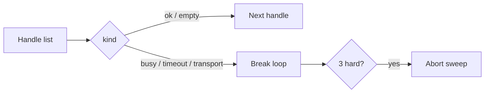

# Sidecar Occupancy

**If you only open one file, open [`START_HERE.md`](START_HERE.md).**

**One sentence:** Sidecar Occupancy classifies HTTP **503 / timeout /
transport** from a single-flight sidecar as a **lock**, and tells your
agent to **break** the username (or job) loop instead of `continue`.

**Value proposition:** Tenacity `@retry` and urllib3 `Retry` retry the
*same call*. A locked sidecar is not a flake. Treating 503 `busy` as
“try the next handle” livelocks the worker and looks like a hang. This
kernel is the missing **break**, plus a three-strike abort — importable
so a curiosity worker cannot forget the paragraph already in
[Curiosity-Docker](https://github.com/CynicalTyr/Curiosity-Docker).

Suggested GitHub / PyPI name: **`sidecar-occupancy`**

## Who it helps

| Who | What they get |
| --- | --- |
| **You (the technician)** | `classify_http` → `should_break_handle_loop` in ten minutes. |
| **AI agents / harnesses** | MCP *inspect* tools that say “stop the batch,” not “retry harder.” |
| **People talking to those agents** | Fewer silent hangs while one scan holds the lock. |

## Who should skip this

Teams whose HTTP backend is already a queue (many concurrent scans).
People who already `break` on occupancy and never wrap 503 in Tenacity.
Anyone looking for a retry library — that is Tenacity.

## How it connects to AI agents



| Style | When |
| ----- | ---- |
| **HTTP worker** (recommended) | Map status codes, then `should_break_handle_loop`. |
| **MCP (classify only)** | `examples/mcp_server.py` — `occupancy_classify`. No hammer-retry tool. |
| **Both** | MCP for chat; HTTP for timers. Same kinds. |

**Client timeout must be longer than worker timeout** (e.g. 120s vs 60s).
Invert that and every slow scan becomes a fake `timeout`.

## 10-minute first success

```bash
chmod +x scripts/smoke.sh
./scripts/smoke.sh
# optional
python3 -m pip install -e .
python3 examples/quickstart.py
```

Success is printed `kind: busy` and `break loop: True` from HTTP 503,
plus `abort_sweep(3) is True`. That rigidity is the product.

## Hardware / software

| Resource | Minimum |
| -------- | ------- |
| OS | Linux, macOS, or Windows with Python **3.10+** |
| RAM | Trivial |
| GPU | **None** |
| Network | **None** for the library itself |

Stdlib only. Optional `mcp` extra to run `examples/mcp_server.py` on the
**agent host**.

## Repository layout

| File | What it does | What you change it for |
| ---- | ------------ | ---------------------- |
| `START_HERE.md` | First-use, 10 minutes | You usually do not |
| `README.md` | Product + hidden dynamics | Forks / rename |
| `docs/INTEGRATION.md` | HTTP worker + MCP wiring | New sidecar |
| `docs/ADVANCED.md` | Occupancy vs retry (search article) | Architecture debates |
| `docs/MCP.md` | Classify / abort inspect tools | Tool names — **no retry tool** |
| `occupancy.py` | `classify_http`, `should_break_handle_loop`, `abort_sweep` | Kinds (rarely) |
| `examples/quickstart.py` | First 503 → busy | Learning |
| `examples/mcp_server.py` | MCP child process | Tool names |
| `examples/mcp.example.json` | Host config template | Absolute paths |
| `tests/` | 503 → break; abort at 3 | Behavior changes |
| `scripts/smoke.sh` | unittest + quickstart | CI locally |
| `.env.example` | Env **names** | Copy to `.env` (never commit `.env`) |

## Related kernels

| Kernel | Why |
| ------ | --- |
| [Curiosity-Docker](https://github.com/CynicalTyr/Curiosity-Docker) | The sidecar that returns 503 `busy`. This repo is the **client policy**. |
| `epistemic-deny` | Tool denies. Occupancy is not a deny — it is a lock. |
| `agent-review-envelope` | Speech dual-control. Occupancy findings should not become a chat novel. |

## What others will discover (that demos hide)

These dynamics show up **after** someone else runs this in a real loop.
Ordinary READMEs skip them; they are why the kernel exists.

| Lens | In this kernel |
| ---- | -------------- |
| **Recurring pattern** | HTTP 503 on a single-flight sidecar is a mutex, not a flake. `break`, do not `continue`. |
| **Feedback loop** | `continue` on busy → more POSTs → lock never releases → “hung” sidecar. `break` + later cycle → lock holder finishes. |
| **Hidden incentive** | Sweep success-rate metrics treat occupancy as failure, so people add parallelism or Tenacity — the worst fix. |
| **Leverage point** | Client timeout must be *longer* than worker timeout (e.g. 120s vs 60s). Invert it and you fake transport death. |
| **Asymmetry** | Empty hits = completed look. Occupancy = try later. Mixing those stamps poisons cooldowns. |
| **Cause → effect** | `for handle in handles` / `except Timeout: continue` / livelock. `should_break_handle_loop` → batch ends. |
| **Opportunity** | Anyone looping handles at a locked worker needs this. Search: HTTP 503 busy sidecar agent. |
| **Risk if copied blindly** | `ALLOWED_IPS=*` plus WAN bind “to fix 403” publishes a scanner. Occupancy will not save a mis-bound port. Adding `occupancy_retry` MCP collapses the product. |

**Hidden principle:** occupancy must **stop the outer loop**. A competent
engineer still violates this by wrapping `/scan` in Tenacity
`retry_if_exception_type` or urllib3 `Retry(status_forcelist=[503])`.
Those libraries retry the *same call*. The lock holder never finishes.

**Mental model:** adopters think “503 means retry.” The governing model is
**503 means another tenant holds occupancy — `break`.** Tenacity
`tenacity/retry.py` (`retry_if_exception_type`, `retry_if_result`)
re-invokes one function. urllib3 `src/urllib3/util/retry.py` lists **503**
in `RETRY_AFTER_STATUS_CODES`. Resilience4j `RetryConfig` defaults to
`maxAttempts=3` / `waitDuration=500ms` on the *same* supplier. None of
those walk a handle list.

**Second-order:** once teams copy this, they will measure “handles per
minute” and add a hammer-retry tool or shorter client timeout “so the
demo isn’t idle.” That metric is the livelock. Count 503s *after* `break`
ships (should fall) vs scans that finish (should rise). Per the
Cynical0n3 NotebookLM (`systems`): retrying 503 on a single-flight
sidecar orphans the lock when the client timeout is shorter than the
worker bound, burns the token budget, and grows KV-cache on a loop that
never yields.

Deeper case studies: [`docs/ADVANCED.md`](docs/ADVANCED.md). Wiring: [`docs/INTEGRATION.md`](docs/INTEGRATION.md).

## License

MIT. See `LICENSE`.
