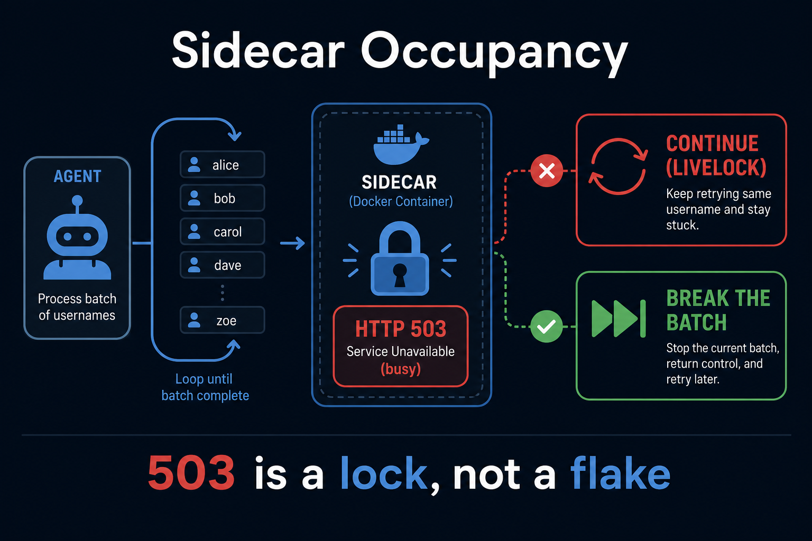
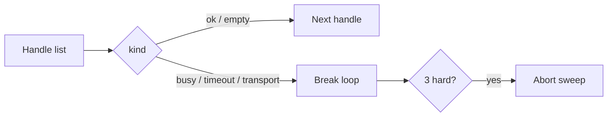

# Sidecar Occupancy

**If you only open one file, open [`START_HERE.md`](START_HERE.md).**



**One sentence:** Sidecar Occupancy classifies HTTP **503 / timeout /
transport** as a **lock**, and tells your agent to **break** the username
(or job) loop instead of `continue`.

**Value proposition:** Single-flight OSINT and scrape sidecars (including
[Curiosity-Docker](https://github.com/CynicalTyr/Curiosity-Docker)) return
`busy` when a scan holds the lock. Treating that as “try the next handle”
livelocks the worker and looks like a hang. This kernel is the missing
**break**, plus a three-strike abort.

Suggested GitHub / PyPI name: **`sidecar-occupancy`**

## Who it helps

| Who | What they get |
| --- | --- |
| **You** | A 10-minute classifier: 503 → `busy` → `break`. |
| **Agents / MCP** | Tools that say “stop the batch,” not “retry harder.” |
| **Sidecar hosts** | CPU that stays on *one* scan. |

## 10-minute first success

```bash
cd occupancy-break
python3 -m pip install -e .
python3 examples/quickstart.py
python3 -m unittest discover -s tests -q
```

## How it connects to AI agents



| Style | When |
| ----- | ---- |
| **HTTP worker** | Map status codes, then `should_break_handle_loop`. |
| **MCP** | `examples/mcp_server.py` — `occupancy_classify`. |
| **Both** | MCP for chat; HTTP for timers. Same kinds. |

**Client timeout must be longer than worker timeout** (e.g. 120s vs 60s).
Invert that and every slow scan becomes a fake `timeout`.

## Hardware / software

Python 3.10+, stdlib. No GPU. Optional `mcp` extra.

## Layout

| File | Role |
| ---- | ---- |
| `occupancy.py` | `classify_http`, `should_break_handle_loop`, `abort_sweep` |
| `docs/MCP.md` | Harness tools |
| `docs/INTEGRATION.md` | Curiosity-Docker + generic sidecars |
| `docs/ADVANCED.md` | Occupancy vs flake, cooldown stamps |
| `examples/mcp_server.py` | Harness tools |

## Related

Curiosity-Docker · `agent-review-envelope` · `reviewer-not-extractor`
(do not stamp 72h cooldown on chat/no-JSON).

## What others will discover (that demos hide)

These dynamics show up **after** someone else runs this in a real loop.
Ordinary READMEs skip them; they are why the kernel exists.

| Lens | In this kernel |
| ---- | -------------- |
| **Recurring pattern** | HTTP 503 on a single-flight sidecar is a mutex, not a flake. break, do not continue. |
| **Feedback loop** | continue on busy → more 503s → “hung” sidecar. break + later cycle → lock holder finishes. |
| **Hidden incentive** | Sweep success-rate metrics treat occupancy as failure, so people add parallelism — the worst fix. |
| **Leverage point** | Client timeout must be *longer* than worker timeout (e.g. 120s vs 60s). Invert it and you fake transport death. |
| **Asymmetry** | Empty hits = completed look. Occupancy = try later. Mixing those stamps poisons cooldowns. |
| **Cause → effect** | for handle in handles / except Timeout: continue / livelock. should_break_handle_loop → batch ends. |
| **Opportunity** | Pairs with Curiosity-Docker. Anyone looping handles at a locked worker needs this. |
| **Risk if copied blindly** | ALLOWED_IPS=* plus WAN bind “to fix 403” publishes a scanner. Occupancy will not save a mis-bound port. |

Deeper case studies: [`docs/ADVANCED.md`](docs/ADVANCED.md). Wiring: [`docs/INTEGRATION.md`](docs/INTEGRATION.md).


## License

MIT.
